# ☁️ Terraform Three-Tier Infrastructure: `terraform-three-tier`

A fully modular Terraform project that deploys a production-style three-tier AWS architecture using reusable modules, remote state management, state locking, and GitHub Actions CI/CD.

This project rebuilds the infrastructure from previous networking, load balancing, and database projects — but this time using Infrastructure as Code (IaC) and modern Terraform workflows.

---

# 🎯 Project Objectives

This project demonstrates how to:

* Build reusable Terraform modules
* Manage infrastructure using Infrastructure as Code
* Store Terraform state remotely in S3
* Prevent concurrent Terraform operations using DynamoDB locking
* Deploy a complete three-tier AWS architecture
* Automate infrastructure validation and deployment through GitHub Actions
* Follow a review-before-deploy workflow using Pull Requests

---

# 🏗️ Architecture

```text
                        Internet
                            │
                            ▼
                   Application Load Balancer
                            │
                            ▼
                 Auto Scaling Group (EC2)
                            │
                            ▼
                    Amazon RDS MySQL

────────────────────────────────────────────

VPC
├── Public Subnet A
│   └── ALB
│
├── Public Subnet B
│   └── ALB
│
├── Private Subnet A
│   └── EC2 Instance
│
├── Private Subnet B
│   └── EC2 Instance
│
├── Internet Gateway
│
└── NAT Gateway
     └── Outbound Internet Access
         For Private Instances
```

---

# 📁 Project Structure

```text
terraform-three-tier/
├── main.tf
├── providers.tf
├── variables.tf
├── outputs.tf
├── locals.tf
├── data.tf
│
├── modules/
│   ├── vpc/
│   ├── security_groups/
│   ├── alb/
│   ├── asg/
│   └── rds/
│
├── backends/
│   └── dev.hcl
│
├── envs/
│   └── dev.tfvars
│
├── userdata.sh
│
├── .github/
│   └── workflows/
│       └── terraform.yml
│
├── .gitignore
├── output_screenshots
└── README.md
```

---

# 🧩 Terraform Modules

## VPC Module

Creates:

* VPC
* Public Subnets
* Private Subnets
* Internet Gateway
* Elastic IP
* NAT Gateway
* Public Route Table
* Private Route Table
* Route Table Associations

Outputs:

* VPC ID
* Public Subnet IDs
* Private Subnet IDs
* NAT Gateway ID
* Route Table IDs

---

## Security Groups Module

Creates:

### ALB Security Group

Allows:

* HTTP (80)
* HTTPS (443)

### Application Security Group

Allows:

* HTTP from ALB SG
* SSH from administrator IP

### RDS Security Group

Allows:

* MySQL (3306)
* Only from Application SG

---

## ALB Module

Creates:

* Application Load Balancer
* Target Group
* HTTP Listener
* Health Check Configuration

Health Check:

```text
Path: /health
Protocol: HTTP
Port: 80
```

---

## ASG Module

Creates:

* Launch Template
* Auto Scaling Group
* Target Tracking Scaling Policy

Scaling Policy:

```text
Target CPU Utilization:
50%
```

ASG Configuration:

```text
Min Capacity: 1
Desired Capacity: 2
Max Capacity: 3
```

---

## RDS Module

Creates:

* DB Subnet Group
* MySQL 8.0 Database
* Private Database Endpoint

Configuration:

```text
Engine: MySQL
Storage: 20GB GP3
Public Access: Disabled
Multi-AZ: Disabled
```

---

# 🔐 Remote State

Terraform state is stored remotely using:

## Amazon S3

Purpose:

* Shared state storage
* State versioning
* State durability

Features Enabled:

* Versioning
* Encryption
* Public Access Block

---

## DynamoDB Locking

Purpose:

* Prevent simultaneous Terraform operations
* Protect state consistency

Example:

```text
Terminal 1:
terraform apply
    ↓
Lock Acquired

Terminal 2:
terraform apply
    ↓
State Lock Error
```

---

# 🤖 GitHub Actions CI/CD

Workflow File:

```text
.github/workflows/terraform.yml
```

Pipeline Stages:

```text
Push / Pull Request
        │
        ▼
Terraform Init
        │
        ▼
Terraform Format Check
        │
        ▼
Terraform Validate
        │
        ▼
Terraform Plan
        │
        ▼
Terraform Apply
```

Benefits:

* Automated validation
* Consistent deployments
* Infrastructure review process
* Repeatable deployments

---

# 🚀 Deployment

Initialize Terraform:

```bash
terraform init -backend-config="backends/dev.hcl"
```

Validate Configuration:

```bash
terraform validate
```

Format Code:

```bash
terraform fmt -recursive
```

Generate Plan:

```bash
terraform plan \
  -var-file="envs/dev.tfvars"
```

Apply Infrastructure:

```bash
terraform apply \
  -var-file="envs/dev.tfvars"
```
Terminal output example:
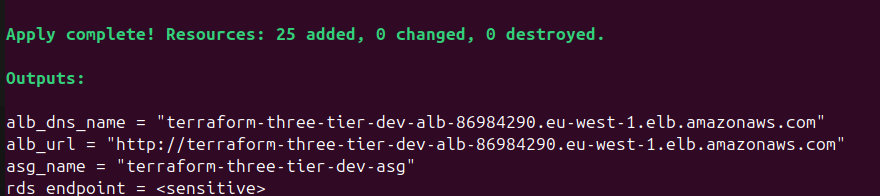

---

# 🧪 Verification

## Verification Evidence

The screenshots below demonstrate successful deployment, load balancing, remote state management, and CI/CD automation.

Display Outputs:

```bash
terraform output
```

Test Application:

```bash
curl $(terraform output -raw alb_url)
```

Browser page example:
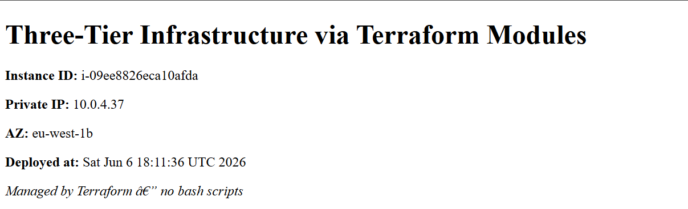


Health Check:

```bash
curl $(terraform output -raw alb_url)/health
```

Expected Response:

```text
healthy
```

Browser page example:
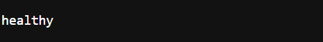

Verify Load Balancing:

```bash
for i in {1..6}; do
  curl -s $(terraform output -raw alb_url) | grep Instance
done
```

Terminal output example:
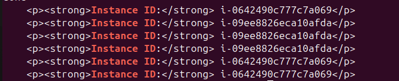

Different instance IDs should appear, demonstrating that traffic is being distributed across multiple EC2 instances by the Application Load Balancer.

Target group:
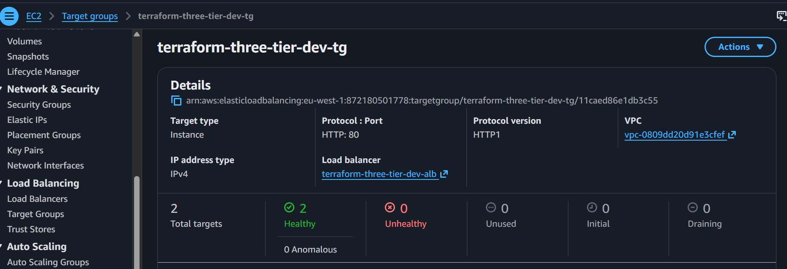

Auto scaling group:
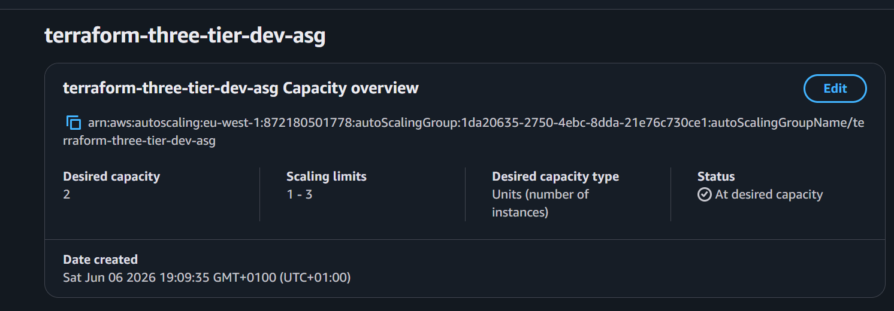

RDS_Instance:
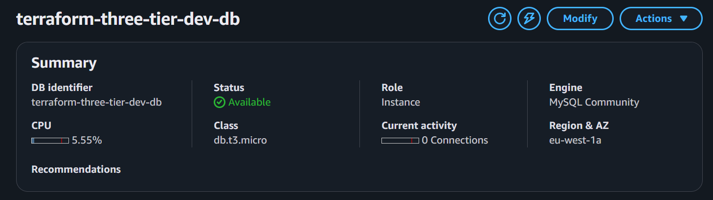

Dynamodb State Lock Table:
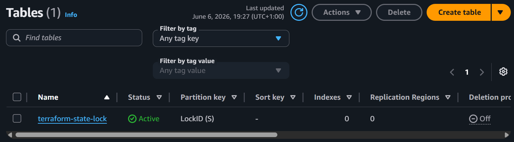

Terraform State S3 Bucket:
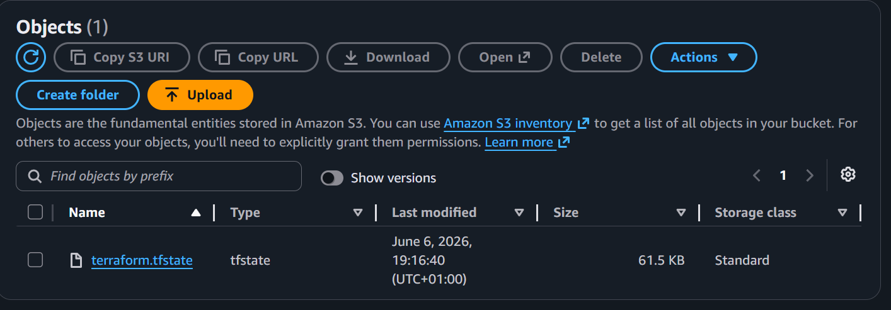

GitHub Actions — Pull Request Plan:
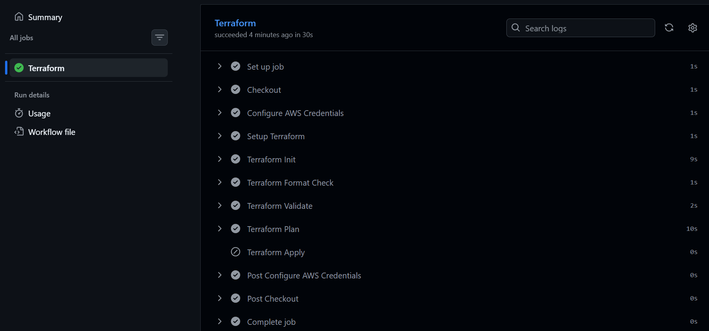

GitHub Actions — Apply on Merge:
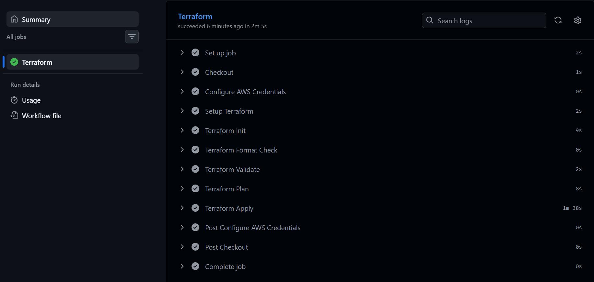

---

# 📊 Resources Managed

Terraform State Includes:

```text
VPC
Subnets
Route Tables
Internet Gateway
NAT Gateway
Elastic IP
Security Groups
Application Load Balancer
Target Group
Listener
Launch Template
Auto Scaling Group
Scaling Policy
RDS Instance
DB Subnet Group
```

Total Managed Resources:

```text
26+
```

---

# 🛠️ Challenges & Lessons Learned

## Remote State Migration

Migrated from local state to S3 backend and verified state storage remotely.

---

## State Locking

Tested concurrent Terraform operations and observed DynamoDB lock protection preventing state corruption.

---

## GitHub Actions Permissions

Resolved workflow deployment issues caused by GitHub Personal Access Token scope limitations and migrated repository operations to SSH authentication.

---

## AWS Credential Configuration

Configured GitHub repository secrets for Terraform workflow execution.

---

## RDS Engine Version Compatibility

Resolved RDS provisioning issues caused by unsupported MySQL engine versions in the selected AWS region.

---

## ALB Health Check Troubleshooting

Investigated target group health check failures and validated application availability using:

```text
/health
```

endpoint verification.

---

## Terraform User Data

Learned how Terraform embeds EC2 bootstrapping scripts directly into Launch Templates using:

```hcl
base64encode(file("userdata.sh"))
```

allowing fully automated instance configuration.

---

# 🧹 Teardown

Destroy Infrastructure:

```bash
terraform destroy \
  -var-file="envs/dev.tfvars"
```

Note:

The S3 backend bucket and DynamoDB lock table remain intentionally because they are not managed by this Terraform configuration.

---

# 🎓 Skills Demonstrated

* Terraform Modules
* Infrastructure as Code (IaC)
* Remote State Management
* State Locking
* AWS Networking
* VPC Design
* Security Groups
* Application Load Balancers
* Auto Scaling Groups
* Launch Templates
* Amazon RDS
* GitHub Actions
* CI/CD Pipelines
* Infrastructure Validation
* Terraform Debugging
* AWS Troubleshooting

---

# 🏁 Outcome

Successfully deployed and managed a complete three-tier AWS architecture using Terraform modules, remote state, and CI/CD automation.

This project represents a transition from scripting infrastructure with AWS CLI and Bash to managing infrastructure using production-style Infrastructure as Code workflows.

